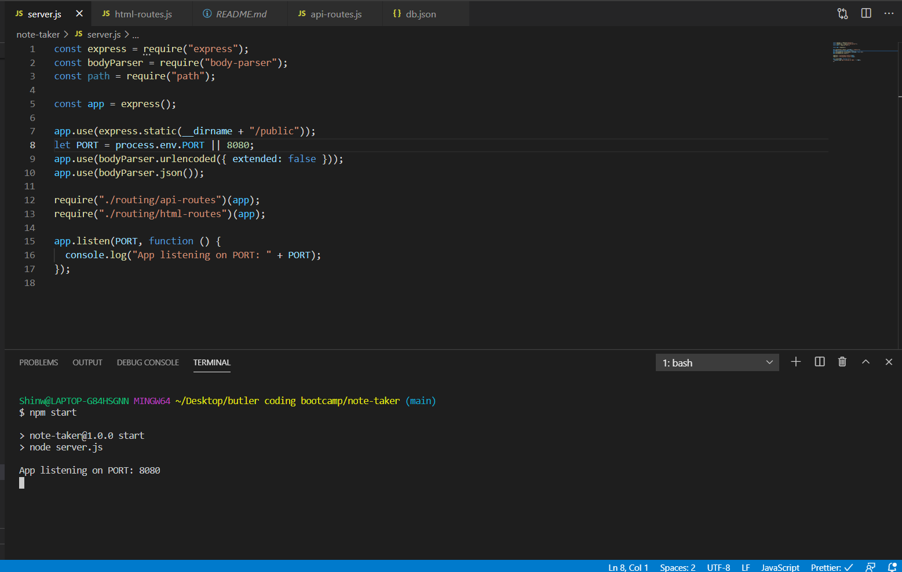
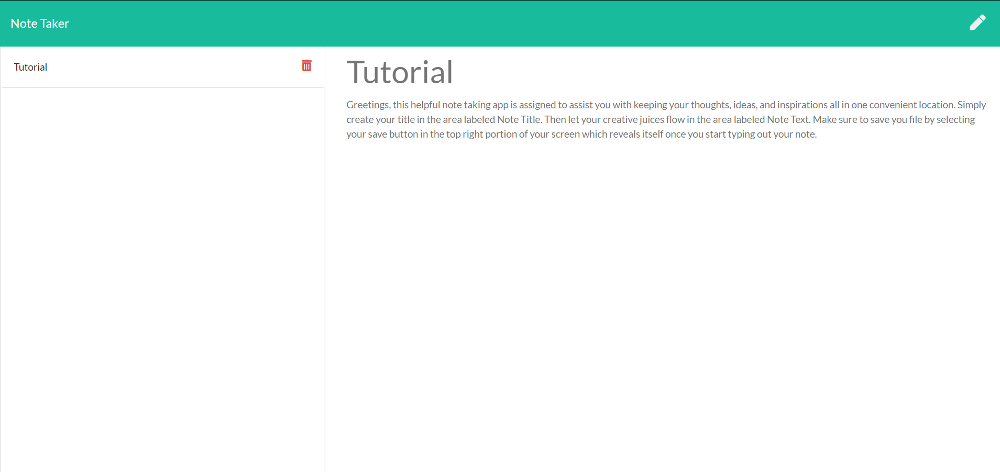

# note-taker

  
  # Table of Contents
  1. [Description](#description)
  
  2. [Installation Instructions](#installationinstructions)
  
  3. [Contribution Guidelines](#contributionguidelines)
  
  4. [Testing Information](#testinginformation)
  
  5. [Contact Information](#contactinformation)

  # Description 
  This project is designed to assist you with keeping your thoughts, ideas, and inspirations all in one convenient location.
  # Installation Instructions
  
  
   
  # Contribution Guidelines
  To contribute to this package, please contact me on GitHub.
  # Testing Information
  No Current Testing
  # Contact Information
  Github: [PonderHavok](https://github.com/PonderHavok)
 
  Email: Transverseponderer@gmail.com
